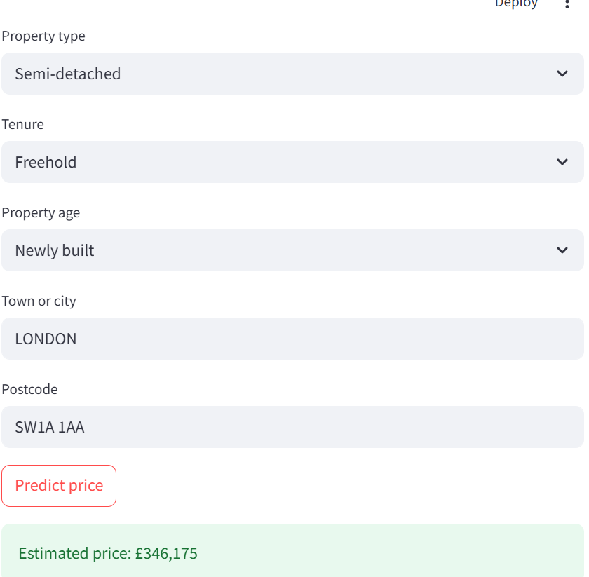

# 🏡 UK Housing Price Predictor

> An end-to-end machine learning pipeline that predicts residential property prices across England and Wales using open government data. Deployed as an interactive web application.

[](https://python.org)
[](https://your-app-name.streamlit.app)
[](LICENSE)
[]()

**[▶ Live Demo](https://emmanuella-housing-predictor.streamlit.app)** · **[Notebook](explore.ipynb)**

---

## Table of contents

- [Project overview](#project-overview)
- [Key results](#key-results)
- [Live demo](#live-demo)
- [Dataset](#dataset)
- [Project structure](#project-structure)
- [Methodology](#methodology)
- [Model performance](#model-performance)
- [How to run locally](#how-to-run-locally)
- [Limitations and future work](#limitations-and-future-work)
- [Acknowledgements](#acknowledgements)

---

## Project overview

First-time buyers and movers often struggle to know whether a property is fairly priced, particularly when comparing across different areas of the UK. This project addresses that by predicting residential property prices based on location, property type, tenure, and age — trained on nearly one million real transactions from HM Land Registry. Because the model learns directly from actual sale prices rather than asking prices, its estimates reflect what buyers have genuinely paid in the open market.

The project simulates the kind of pipeline a data scientist might build at a PropTech company, mortgage lender, or estate agency: ingest real transactional data, engineer meaningful features, train and evaluate multiple models, and deploy a user-facing tool.

---

## Key results

| Metric | Linear Regression (baseline) | XGBoost (no location) | XGBoost (final) |
|---|---|---|---|
| RMSE | 0.64 | 0.47 | 0.21 |
| R² | 0.15 | 0.54 | 0.91 |

> All metrics computed on a held-out test set (20% of data, ~183,000 transactions).
> The dramatic improvement from 0.15 to 0.91 came primarily from adding postcode-level location encoding — confirming that location is the dominant predictor of UK house prices.

---

## Live demo

The model is deployed as a Streamlit application at **[emmanuella-housing-predictor.streamlit.app](https://emmanuella-housing-predictor.streamlit.app/)**.

Enter a postcode, property type, and tenure → the app returns an estimated sale price based on real historical transactions.



---

## Dataset

### Source

| Dataset | Source | Rows (raw) | Rows (after cleaning) | Licence |
|---|---|---|---|---|
| Price Paid Data (2024) | [HM Land Registry](https://www.gov.uk/government/collections/price-paid-data) | 923,729 | 915,672 | Open Government Licence v3 |

All data is publicly available and free to download. No proprietary or private data is used.

### Cleaning steps

- Added column names (the raw CSV has no headers)
- Removed 2,748 rows with missing postcodes
- Removed ~5,300 rows with prices below £10,000 or above £5,000,000 (extreme outliers and likely non-market transactions)

### Key columns used

| Column | Description |
|---|---|
| `price` | Sale price in GBP (target variable) |
| `postcode` | Full postcode — encoded as mean log price per postcode |
| `town_city` | Town or city — encoded as mean log price per town |
| `property_type` | D = Detached, S = Semi-detached, T = Terraced, F = Flat, O = Other |
| `tenure` | F = Freehold, L = Leasehold |
| `old_new` | Y = Newly built, N = Existing property |
| `date` | Transaction date — year and month extracted as features |

---

## Project structure

```
uk-housing-price-predictor/
│
├── explore.ipynb           # Full pipeline: EDA, feature engineering, modelling, SHAP
├── app.py                  # Streamlit deployment app
├── town_means.json         # Mean log price per town (used by app)
├── postcode_means.json     # Mean log price per postcode (used by app)
├── .gitignore
└── README.md
```

> The raw CSV and trained model file are excluded from the repository via .gitignore.
> To reproduce, download the data and run explore.ipynb — see instructions below.

---

## Methodology

### 1. Exploratory data analysis

The price distribution was found to be heavily right-skewed — most properties sold between £200,000–£400,000 but a long tail stretched toward £5,000,000. A log transformation was applied to the target variable to normalise the distribution and prevent the model from over-weighting expensive outliers.

Key findings from EDA:
- Detached properties command the highest average prices (£498,000), followed by flats (£317,000), semi-detached (£312,000), and terraced (£284,000)
- The most expensive areas are wealthy commuter belt towns surrounding London — Cobham, Virginia Water, Esher — rather than London itself as a label
- Leasehold properties consistently sell for less than equivalent freeholds

### 2. Feature engineering

| Feature | Method |
|---|---|
| `property_type` | One-hot encoded into binary columns |
| `tenure` | One-hot encoded into binary columns |
| `old_new` | One-hot encoded into binary columns |
| `town_city` | Target encoded — replaced with mean log price per town |
| `postcode` | Target encoded — replaced with mean log price per postcode |
| `year`, `month` | Extracted from the transaction date string |

### 3. Modelling

Two models were trained and compared using an 80/20 train/test split:

**Linear Regression (baseline)**: Achieved R² of 0.15 with no location features. Adding town-level encoding improved this to 0.54, demonstrating the importance of location.

**XGBoost**: A gradient boosting algorithm that builds hundreds of decision trees sequentially, each learning from the errors of the previous one. Switching to XGBoost with postcode-level encoding achieved a final R² of 0.91.

### 4. Model interpretation

SHAP (SHapley Additive exPlanations) values were computed on the test set to understand which features drive individual predictions. Key findings:

- `postcode_encoded` has by far the largest impact — high-value postcodes strongly push predicted prices upward
- `property_type_D` (detached) consistently adds value; `property_type_F` (flat) reduces it
- Leasehold tenure has a consistent negative effect on predicted price

---

## How to run locally

### Prerequisites

- Python 3.10+
- Anaconda recommended

### 1. Clone the repo

```bash
git clone https://github.com/emmanuellabinjo/uk-housing-price-predictor.git
cd uk-housing-price-predictor
```

### 2. Install dependencies

```bash
pip install pandas numpy scikit-learn xgboost streamlit matplotlib seaborn shap joblib
```

### 3. Download the data

Go to [HM Land Registry Price Paid Data](https://www.gov.uk/government/statistical-data-sets/price-paid-data-downloads) and download the 2024 yearly file. Save it as `pp-2024.csv` in the project folder.

### 4. Run the notebook

Open `explore.ipynb` and run all cells. This will:
- Clean and process the raw data
- Engineer features
- Train the XGBoost model
- Save `housing_model.joblib`, `town_means.json`, and `postcode_means.json`

### 5. Launch the app

```bash
streamlit run app.py
```

Open [http://localhost:8501](http://localhost:8501) in your browser.

---

## Limitations and future work

### Current limitations

- **No floor area data**: HM Land Registry Price Paid Data does not include square footage — arguably the most important predictor of value after location. The EPC (Energy Performance Certificate) register from DLUHC includes floor area and could be merged on address.

- **Target encoding leakage**: Postcode and town mean prices were calculated on the full dataset rather than strictly on the training set, which introduces mild data leakage. The true generalisation performance is likely slightly lower than R² 0.91.

- **Single year of data**: Only 2024 transactions were used. Training on multiple years would capture long-run price trends more robustly.

- **Static model**: The model does not update in real time and will drift as market conditions change.

### Planned improvements

- [ ] Merge EPC floor area data to add square footage as a feature
- [ ] Implement strict train-only target encoding to eliminate leakage
- [ ] Extend dataset to 2020–2024 to capture post-COVID price movements
- [ ] Add model monitoring to track drift on new transactions
- [ ] Deploy with automatic quarterly retraining

---

## Acknowledgements

- [HM Land Registry](https://www.gov.uk/government/organisations/land-registry) for the Price Paid Data, published under the Open Government Licence
- The [SHAP library](https://shap.readthedocs.io/) by Scott Lundberg et al. for model explainability
- [Streamlit](https://streamlit.io/) for making model deployment accessible

---

## Licence

This project is licensed under the MIT Licence.

The underlying data is published under the [Open Government Licence v3.0](https://www.nationalarchives.gov.uk/doc/open-government-licence/version/3/).

---

*Built as part of a data science portfolio. Questions or suggestions? Open an issue or connect on [LinkedIn](www.linkedin.com/in/emmanuel-labinjo).*